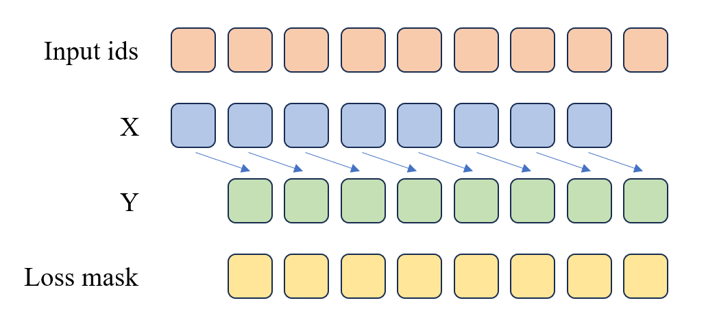
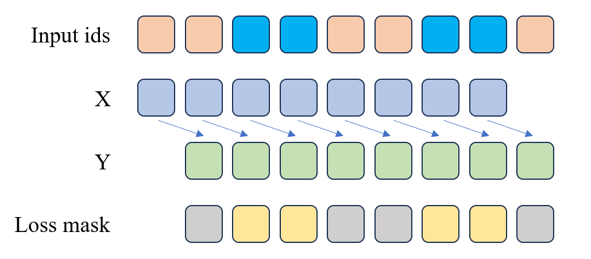

# 动手实现LLaMA2
## 定义超参数
[modelConfig.py](./modelConfig.py)继承了transformers库中的参数类，方便后续导出huggingface参数模型

## 实现RMSNorm
公式：
$$
\text{RMSNorm}(x) = \frac{x}{\sqrt{\frac{1}{n} \sum_{i=1}^{n} x_i^2 + \epsilon}} \cdot \gamma
$$

[rmsNorm.py](./rmsNorm.py)实现了RMSNorm类，层归一化

## repeat kv
在transformer架构中，qkv的维度是一样的。不存在维度缩放的问题。在LLaMa2中，为了拯救 GPU 显存（解决 KV Cache 爆炸问题），引入了 repeat_kv 参数。该参数控制了在计算注意力时，键（K）和值（V）是否重复使用。具体来说，先看transformer的mha：
```python
        # 为什么是先展开后转置
        xq = xq.view(bsz, seqlen, self.n_heads, self.head_dim)
        xk = xk.view(bsz, seqlen, self.n_heads, self.head_dim)
        xv = xv.view(bsz, seqlen, self.n_heads, self.head_dim)
        xq = xq.transpose(1, 2)
        xk = xk.transpose(1, 2)
        xv = xv.transpose(1, 2)
```
这里补充下：由于数据在显存中是连续存储的，view并没有改变数据物理位置，只是逻辑上把数据看作"token A 的第一个头、token A 的第二个头、...、token B 的第一个头、token B 的第二个头、..."。如果直接view成(bsz, self.n_heads, seqlen, self.head_dim)，就会把数据看作"token A 的第一个头、token B 的第一个头、...、token A 的第二个头、token B 的第二个头、..."，这样在计算注意力时就会出问题。所以一定要先view再转置

根据transformer的mha实现，可以发现它的qkv拥有一样的头，这会导致一个问题：当输入序列长度很长时，kv cache的开销会很恐怖。因此有了MQA(Multi Query Attention)，它的kv只有一个头而Q是多头的。但是这样性能就会下降。而GQA(Grouped Query Attention)就是LLaMA的折中方法，LLaMA 会把 Q 的头进行**分组**。比如Q有32个头，而K和V的头有8个，每四个Q头一组共用一个K和V头。降低了 KV Cache 的开销。

[repeat_kv.py](./repeat_kv.py)就是负责把kv临时复制出份数来，让它和Q对齐。

## 旋转位置编码
**旋转位置编码（Rotary Position Embedding，简称 RoPE）。**
旋转嵌入（RoPE）是目前大语言模型（如 LLaMA、GLM 等）中最主流、最核心的位置编码方式。

和transformer一样具有外推性。
二维旋转矩阵：
$$
Rot(\theta)=
\begin{bmatrix}
\cos\theta & -\sin\theta \\
\sin\theta & \cos\theta
\end{bmatrix}
$$

对于维度为 $d$ 的向量 $\mathbf{q} = [q_0, q_1, \dots, q_{d-1}]^T$，RoPE 将其划分为 $d/2$ 个二维子空间，每一组分量 $(q_{2i}, q_{2i+1})$ 通过旋转矩阵进行变换。即：
$$
\begin{bmatrix}
q'_{2i} \\
q'_{2i+1}
\end{bmatrix} = \begin{bmatrix}
\cos\theta & -\sin\theta \\
\sin\theta & \cos\theta
\end{bmatrix} 
\begin{bmatrix}q_{2i} \\
q_{2i+1}
\end{bmatrix}
$$
而且做内积后，两个向量旋转后的角度差只有相对角度有关。
$$
\langle \mathbf{f}(\mathbf{q}, m), \mathbf{f}(\mathbf{k}, n) \rangle = (\mathbf{R}_m \mathbf{q})^T (\mathbf{R}_n \mathbf{k}) = \mathbf{q}^T \mathbf{R}_m^T \mathbf{R}_n \mathbf{k}
$$

由于旋转矩阵具有性质 $\mathbf{R}_m^T = \mathbf{R}_m^{-1} = \mathbf{R}_{-m}$，上式变为：
$$
\mathbf{q}^T (\mathbf{R}_{-m} \mathbf{R}_n) \mathbf{k} = \mathbf{q}^T \mathbf{R}_{n-m} \mathbf{k}
$$

$\mathbf{R}_{n-m}$ 代表的是相对旋转角度为 $(n-m)\theta_i$ 的旋转矩阵。
因此，最终的点积结果只依赖于 **$n-m$**（即 Query 和 Key 之间的相对距离），而不是它们的绝对位置 $m$ 和 $n$。


令 $\mathbf{q} = [q_0, q_1, q_2, q_3, \dots]$，旋转后的 $\mathbf{q}'$ 为：
$$
\begin{aligned}
q'_0 &= q_0 \cos(m\theta_0) - q_1 \sin(m\theta_0) \\
q'_1 &= q_0 \sin(m\theta_0) + q_1 \cos(m\theta_0) \\
&\dots
\end{aligned}
$$


$$
f(\mathbf{q}, m) = \text{Rot}(\mathbf{q}, m) = \begin{pmatrix}
\cos m\theta_0 & -\sin m\theta_0 & 0 & 0 & \dots \
\sin m\theta_0 & \cos m\theta_0 & 0 & 0 & \dots \
0 & 0 & \cos m\theta_1 & -\sin m\theta_1 & \dots \
0 & 0 & \sin m\theta_1 & \cos m\theta_1 & \dots \
\vdots & \vdots & \vdots & \vdots & \ddots
\end{pmatrix}
\begin{pmatrix} q_0 \ q_1 \ q_2 \ q_3 \ \vdots \end{pmatrix}
$$

## mlp
传统的transformer中，MLP部分的激活函数通常是RELU激活函数的两层感知机（**其中隐藏层的维度是4d**），但LLaMA2中使用了一种**门控线性单元（Gated Linear Unit, GLU）**,效果更好。大致的工作原理为，权重w1负责提取特征，权重w3负责决策那一部分特征需要被保留，w2负责把保留的特征映射回模型维度。公式如下：
$$
output = w_2 \cdot(silu(w_1 \cdot input) \cdot w_3 \cdot input)
$$
虽然SwiGLU效果更好，但是因为至少要三部分权重，所以后让参数变为原始的1.5倍左右。所以要×个2/3来控制参数量不变。还要向上取整为multiple_of 的倍数，因为乘了2/3很可能就不是8或128的倍数了，为了让硬件高效计算要控制它对特定的数字向上取整。

## LLaMA2的Transformer架构
[llama2](./llama2.py)实现了LLaMA2的Transformer架构，包含了Decoder mlp等。

初始化权重，在[llama2.py第50-51行](./llama2.py#L50-L51)中，运用apply函数递归地将init_weights函数应用于模型的每个子模块。init_weights函数检查每个模块的类型，如果是nn.Linear或nn.Embedding，就使用正态分布初始化权重，均值为0，标准差为0.02；如果是nn.Linear且有偏置项，就将偏置项初始化为0。这种初始化方法有助于模型在训练初期保持稳定，促进更快的收敛。

对残差投影进行特殊的缩放初始化。在[llama2.py第53-56行](./llama2.py#L53-L56)中，针对残差连接的线性层（即投影层），需要进行缩小。因为残差连接的x=x+f(x)，随着层数增加数值大小会不断叠加累积。可能会导致梯度爆炸不利于训练。所以要给特殊的层如前馈网络的w3和wo进行缩小。

## 训练Tokenizer
### word based tokenizer
基于单词的分词器，直接将文本分割成单词。这种方法简单，但可能会导致大量的未登录词（OOV）和罕见词问题，对复合词（如“New York”）或缩略词（如“don't”）的处理也不够精细。

### Character-based Tokenizer
将文本中的每个字符视为一个独立的 token。这种方法能非常精细地处理文本，适用于处理拼写错误、未登录词或新词。由于每个字符都是一个独立的 token，因此这种方法可以捕捉到非常细微的语言特征。但是，这种方法也会导致 token 序列变得非常长，此外，字符级的分割可能会丢失一些词级别的语义信息，使得模型难以理解上下文。

### subword Tokenizer
Subword Tokenizer 的关键思想是将文本分割成比单词更小的单位，但又比字符更大，这样既能处理未知词，又能保持一定的语义信息。
- Byte Pair Encoding (BPE)：BPE 是一种基于统计的方法，通过反复合并频率最高的字符或字符序列对来生成子词词典。BPE 的合并过程是自底向上的，逐步将频率最高的字符对合并成新的子词，直到达到预定的词典大小或不再有高频的字符对。
- WordPiece：WordPiece 是另一种基于子词的分词方法，最初用于谷歌的 BERT 模型。与 BPE 类似，WordPiece 通过最大化子词序列的似然函数来生成词典，但在合并子词时更注重语言模型的优化。WordPiece 会优先选择能够最大化整体句子概率的子词，使得分词结果在语言模型中具有更高的概率。自顶向下。
- Unigram：Unigram 分词方法基于概率模型，通过选择具有最高概率的子词来分割文本。Unigram 词典是通过训练语言模型生成的，可以处理多种语言和不同类型的文本。Unigram 模型会为每个子词分配一个概率，然后根据这些概率进行最优分割。

### 下载数据集
跟随happyllm的教程，下载序列猴子数据集。
`.myLLaMA2/dataset/download_dataset.sh`脚本使用了modelscope和huggingface sdk来下载数据集。

### 数据清洗
`./dataset/deal_dataset.py`脚本负责对下载的数据集进行清洗和预处理。它会读取原始数据文件，提取文本内容，并将其保存为新的jsonl文件，以便后续的训练使用。

### 训练BPE分词器
[train_tokenizer](./dataset/train_tokenizer.py)脚本负责从下载的数据集中提取文本，并生成 Hugging Face transformers 库所要求的配置文件。使用了qwen2.5风格的chattemplate。

### 预训练数据集和SFT数据集
预训练和sft采用了不同的loss计算方式，具体可以看图:



遇到了两个问题，一是算力不够：
> 大家在训练的时候可以将 batch 调的低一些，这样可以减少显存的占用，避免显存不足的问题。当然这样会增加训练时间，可以根据自己的显卡显存大小来调整 batch 的大小。实测 Pretrain batch 为 4 的情况下只需要 7G 显存，训练时长预计 533 小时。作者是在 8卡4090 上进行训练的，预训练一共耗时 46 小时，SFT 阶段在 BelleGroup 350万条中文指令训练 24 小时。

几十个小时的训练时间已经是我们个人用户的极限，搞8卡服务器也不现实。所以我尝试限制数据块的大小，限制训练条目的数量，来控制训练时间在可接受的范围内。毕竟我们只需跑通全流程即可，不需要追求模型性能。尝试在读取jsonl文件时增加一个max_lines参数来限制训练数据量。然后添加预计的训练时间，将训练时间控制好。
